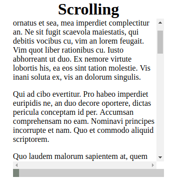
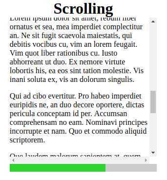
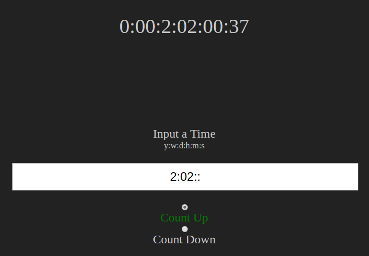
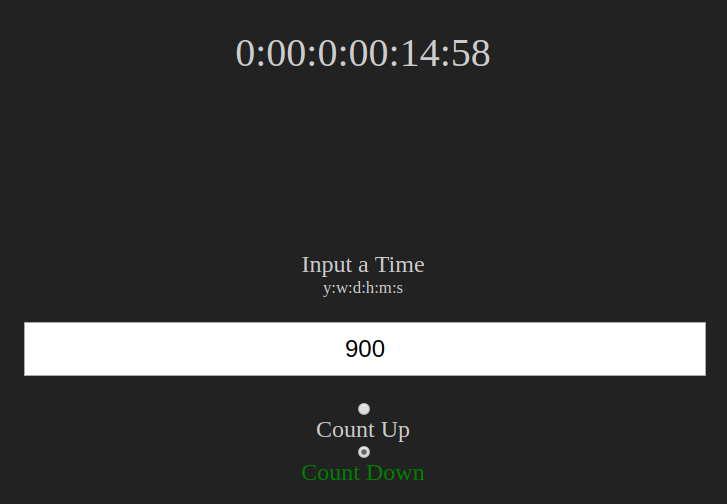

# Web Front End

## Sandbox and Examples

### Scrub/Progress Bar with HTML5 Range Input

[Live Version](https://apankow1234.github.io/web-front-end/scrub-bar.html)

### Scroll Progress

[Live Version](https://apankow1234.github.io/web-front-end/custom-timer.html)

### Custom Timer (Up and Down)

[Live Version](https://apankow1234.github.io/web-front-end/scrub-bar.html)

### Animating SVG with JavaScript and CSS

[Gradient](https://apankow1234.github.io/web-front-end/mouse-tracking.html)

[Eyes](https://apankow1234.github.io/web-front-end/svg-eyes.html)

